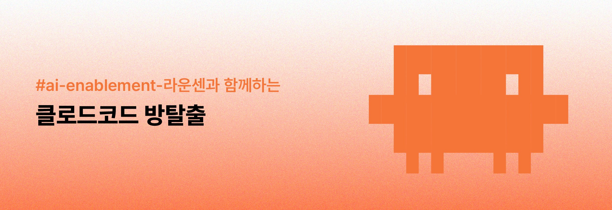
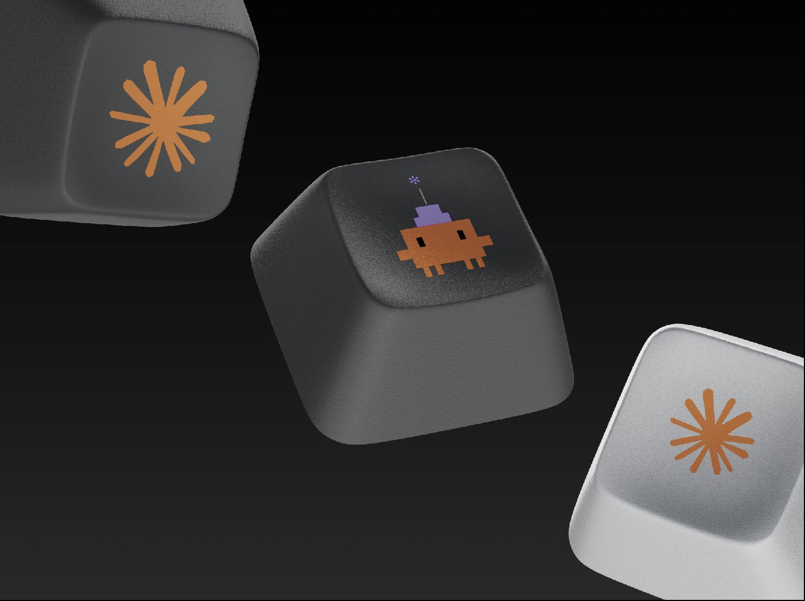

<div align="center">



# 🔐 클로드코드 방탈출

**#ai-enablement-라운센과 함께하는 7일간의 몰입형 AI 방탈출**

</div>

---

```
 ▐▛███▜▌    CLAUDE CODE 방탈출 · welcome!
▝▜█████▛▘   "코드는 도구다. 너의 문제는 무엇인가?"
  ▘▘ ▝▝
```

> 안녕하세요! 클로드코드 방탈출에 오신 걸 환영합니다 🎉  
> 이 문서는 방탈출 참여 전 꼭 읽어보셔야 할 **참여자용 안내서**입니다.

---

## 📑 목차

1. [방탈출 소개](#-방탈출-소개)
2. [왜 하나요?](#-왜-하나요)
3. [어떻게 진행되나요?](#-어떻게-진행되나요)
4. [미션 로드맵](#-미션-로드맵-7일-과정)
5. [보상 안내](#-언제-어떤-선물을-받나요)
6. [참여 전 준비물](#-참여-전-준비물)
7. [도움이 필요할 때](#-도움이-필요할-때)
8. [주요 일정](#-주요-일정)
9. [자주 묻는 질문 (FAQ)](#-자주-묻는-질문-faq)

---

## 🎯 방탈출 소개

```
 ▐▛███▜▌    "강의는 끝났을 때 잊혀진다.
▝▜█████▛▘    하지만 직접 만든 도구는 매일 쓰게 된다."
  ▘▘ ▝▝
```

**클로드코드 방탈출**은 단순히 강의를 듣는 프로그램이 아닙니다.  
여러분이 **직접 본인 업무의 문제를 가져와서**, Claude Code로 그 문제를 해결하는  
**몰입형 미션 수행 방탈출**입니다.

- 📍 **장소**: 슬랙 (Mission 1~5 채널)
- 🗓 **기간**: 5월 13일(수) ~ 6월 12일(금)
- 👥 **운영**: AI 코치 **서현, 신영**
- 🎮 **방식**: 미션 통과 시 다음 방으로 자동 초대 (방탈출 형식!)

---

## 🤔 왜 하나요?

AI 도구가 빠르게 보급되고 있지만, **'들어본 것'과 '실제로 쓸 줄 아는 것'은 다릅니다.**  
이 방탈출을 마치면 여러분은:

| Before | → | After |
|---|:---:|---|
| Claude를 채팅창에서만 써봤다 | → | 터미널에서 자유롭게 다룬다 |
| AI로 뭘 자동화할지 막연하다 | → | 내 업무 자동화 도구 1개를 갖는다 |
| 프롬프트만 입력해봤다 | → | AI에게 일을 시키는 방법을 안다 |
| "AI 쓴다"는 말을 모호하게 한다 | → | 구체적인 사례를 갖고 말한다 |

### 🎁 방탈출이 끝나면 손에 남는 것
- ✅ 내가 직접 만든 **업무 자동화 도구 1개**
- ✅ Claude Code 사용 경험 (CLI, MCP, 워크플로우)
- ✅ 회고록 + README (포트폴리오로 활용 가능)
- ✅ 그리고... **귀여운 키캡 굿즈** 🎹

---

## 🛠 어떻게 진행되나요?

### 1단계: 진입

```
 ▐▛███▜▌    "환영해.
▝▜█████▛▘    첫 번째 방의 문이 열렸다."
  ▘▘ ▝▝
```

- `Mission 1` 채널부터 시작합니다
- 모든 참여자는 **본인이 해결하고 싶은 작은 업무 문제 1개**를 들고 와야 합니다

### 2단계: 미션 수행 → 다음 방 진입
- 각 방에서 미션을 수행하고, **스레드에 결과물을 제출**하면
- 자동으로 **다음 미션 방에 초대**됩니다
- 막히면? → [도움이 필요할 때](#-도움이-필요할-때) 섹션 참고!

### 3단계: 최종 탈출 🏆
- Mission 5까지 완수하면 방탈출 클리어!
- 최종 데모를 `#ai-enablement-라운센`에 공유하면 → 🎁 키캡 굿즈 획득

### ⚠️ 문제 선정 가이드 (중요!)
> "회사 전체 업무를 AI로 자동화하겠다" ❌ (너무 큼)  
> "회의록을 자동으로 요약해서 슬랙에 보내는 봇 만들기" ⭕ (딱 좋음)

**작고 구체적인 문제**일수록 방탈출 기간 안에 끝낼 수 있어요.  
관리자가 보기에 부적절하다고 판단되면 안내 후 조정 또는 퇴장 처리될 수 있습니다.

---

## 🗺 미션 로드맵 (7일 과정)

```
 ▐▛███▜▌    "다섯 개의 방. 일곱 개의 낮.
▝▜█████▛▘    끝에는 너만의 도구가 기다리고 있다."
  ▘▘ ▝▝
```

| 단계 | 미션명 | 주요 내용 | 산출물 | 보상 |
|:---:|---|---|---|:---:|
| **M1** | 환경 구축 | Claude Code 설치 및 터미널 첫 대화 | 설치 스크린샷 + 코멘트 | - |
| **M2** | 문제 정의 | CLAUDE.md 작성 + 해결 과제 구체화 | CLAUDE.md, 선정 과제 | - |
| **M3** | 프로토타입 | 과제 분해 + 핵심 기능(MVP) 구현 | 코드 스니펫, 실행 영상 | ☕ **커피 쿠폰** |
| **M4** | 통합 & 개선 | 워크플로우 연결 + AI 코드 리뷰 | 통합 결과물, 개선 리포트 | - |
| **M5** | 데모 & 회고 | 최종 시연 + 학습 경험 공유 | 데모 영상, README | 🎹 **키캡 세트** |

### 📋 미션별 상세

<details>
<summary><b> Mission 1. Claude Code 세팅하기 (Day 1, 1~2시간)</b></summary>

- **목표**: Claude Code를 본인 환경에 설치하고 첫 대화 나누기
- **수행**: Claude Code 설치 → 터미널에서 첫 대화 시도
- **제출물**: 터미널 대화 스크린샷 + 첫 질문에 대한 짧은 코멘트
- **공식 자료**:
  - 📘 [Claude Code 시작하기 (공식 Overview)](https://code.claude.com/docs/en/overview)
  - 📘 [Quickstart — 첫 작업 따라하기](https://code.claude.com/docs/en/quickstart)
  - 🛠 [설치 트러블슈팅 가이드](https://code.claude.com/docs/en/troubleshoot-install)
  - 🎓 [무료 강좌: Claude Code 101 (Anthropic Academy)](https://anthropic.skilljar.com/claude-code-101)

</details>

<details>
<summary><b> Mission 2. CLAUDE.md 작성 + 풀고 싶은 문제 정의 (Day 2, 2~3시간)</b></summary>

- **목표**: 자기소개 CLAUDE.md 작성 + 방탈출에서 풀 문제 1개 정의
- **수행**:
  1. Claude와 대화하며 CLAUDE.md 생성 (가치관 / 업무 스타일 / 해결 과제 포함)
  2. 정한 과제에 대해 Claude에게 3번 질문하고 가장 좋았던 Q&A 1개 선택
- **제출물**:
  - CLAUDE.md에서 가장 마음에 드는 문장 1개
  - 1주일간 해결할 과제
  - 선택한 질문/답변과 그 이유
- **공식 자료**:
  - 📘 [CLAUDE.md & 메모리 시스템 가이드](https://code.claude.com/docs/en/memory)
  - 📘 [AskUserQuestion / 사용자 입력 처리](https://code.claude.com/docs/en/agent-sdk/user-input)
  - 📘 [Claude Code 모범 사례 (Best Practices)](https://code.claude.com/docs/en/best-practices)

</details>

<details>
<summary><b> Mission 3. 문제 분해 + 첫 프로토타입 만들기 ☕ (Day 3~4, 4~6시간)</b></summary>

- **목표**: 문제를 작은 단위로 쪼개고, 가장 작은 단위 1개를 동작하게 만들기
- **수행**:
  1. Claude와 함께 문제를 3~5개의 작은 작업으로 분해  
     예) "회의록 봇" → 입력받기 / 요약 / 액션아이템 추출 / 슬랙 전송
  2. 가장 먼저 시작할 작업 1개를 Claude Code로 구현 (동작만 하면 OK)
- **제출물**:
  - 분해된 작업 리스트
  - 첫 작업 코드 스니펫 또는 깃헙 링크
  - 실행 결과 스크린샷/영상 (10초 이내)
- **🎁 자랑 챌린지**: `#ai-enablement-라운센`에 첫 프로토타입 공유 시 **커피 쿠폰**!
- **공식 자료**:
  - 📘 [Plan Mode 활용법 (Best Practices)](https://code.claude.com/docs/en/best-practices)
  - 📘 [일반 워크플로우 모음](https://code.claude.com/docs/en/common-workflows)
  - 📄 [How Anthropic Teams Use Claude Code (PDF)](https://www-cdn.anthropic.com/58284b19e702b49db9302d5b6f135ad8871e7658.pdf)
  - 🎓 [무료 강좌: Claude Code in Action](https://anthropic.skilljar.com/claude-code-in-action)

> 💡 **이 구간이 가장 막히기 쉽습니다.** 막히면 즉시 AI 코치(서현·신영)에게 도움을 요청하세요!

</details>

<details>
<summary><b> Mission 4. 통합 & 개선하기 (Day 5~6, 5~7시간)</b></summary>

- **목표**: 분해한 작업들을 하나의 워크플로우로 연결하고, Claude와 함께 개선하기
- **수행**:
  1. Mission 3에서 쪼갠 작업 중 2~3개를 연결해 실제 워크플로우 완성  
     예) 입력 → 요약 → 슬랙 전송 한 번에 동작
  2. Claude에게 "개선점 3가지 알려줘" 요청 후 1개 이상 실제 반영
  3. 본인이 만든 도구를 실제로 1번 이상 사용해보기
- **제출물**:
  - 동작 영상 (30초 이내)
  - Before / After 코드 또는 결과 비교
  - 실제 사용해본 소감 (잘된 점/아쉬운 점 각 1개)
- **공식 자료**:
  - 📘 [MCP 연결하기 (외부 도구 통합)](https://code.claude.com/docs/en/mcp)
  - 📘 [서브에이전트 만들기](https://code.claude.com/docs/en/sub-agents)
  - 📘 [Skills로 워크플로우 패키징](https://code.claude.com/docs/en/skills)
  - 📘 [GitHub 코드 리뷰 자동화](https://code.claude.com/docs/en/code-review)
  - 🎓 [무료 강좌: Introduction to MCP](https://anthropic.skilljar.com/introduction-to-model-context-protocol)
  - 📄 [Advanced Patterns: Subagents·MCP·Scaling (PDF)](https://resources.anthropic.com/hubfs/Claude%20Code%20Advanced%20Patterns_%20Subagents,%20MCP,%20and%20Scaling%20to%20Real%20Codebases.pdf)

</details>

<details>
<summary><b> Mission 5. 최종 데모 & 회고 🏆 (Day 7, 2~3시간)</b></summary>

- **목표**: 미션 정리하고 여정 정리하고 공유하기
- **수행**:
  - 시작 시 정한 문제 → 최종 결과물까지 여정 회고
  - 간단한 README 작성 (설치/사용법)
  - `#ai-enablement-라운센`에 최종 데모 공유
- **제출물**:
  - 최종 결과물 데모 영상 (1분 이내 권장)
  - README 링크
- **🏆 최종 보상**: Mission 5 클리어 인증 + **키캡 세트** 🎹
- **공식 자료**:
  - 📘 [README·문서 자동 생성 워크플로우](https://code.claude.com/docs/en/common-workflows)
  - 📘 [메모리 & CLAUDE.md로 문서 정리하기](https://code.claude.com/docs/en/memory)
  - 🎓 [Claude Code in Action — 실전 워크플로우](https://anthropic.skilljar.com/claude-code-in-action)
  - 📺 [Anthropic 공식 YouTube 채널](https://www.youtube.com/@anthropic-ai)

</details>

---

## 🎁 언제, 어떤 선물을 받나요?

```
 ▐▛███▜▌    "보상은 끝에만 있는 게 아니야.
▝▜█████▛▘    중간에도 자랑하면 챙겨갈 수 있어!"
  ▘▘ ▝▝
```

### 🎯 보상 타이밍

| 시점 | 무엇을 하면? | 받는 것 |
|---|---|:---:|
| **Mission 3 완료 시** | `#ai-enablement-라운센`에 첫 프로토타입 자랑 | ☕ **커피 쿠폰** |
| **Mission 4 완료 시** | (선택) 라운지에 통합 결과 자랑 | ☕ **추가 자랑 챌린지 선물** |
| **Mission 5 완료 시** | 최종 데모 영상 공유 | 🎹 **키캡 세트** (아래 사진!) |

### 🎹 최종 보상: 키캡 굿즈

<div align="center">



*Mission 5까지 완수한 분께 드리는 한정판 키캡 세트*

</div>

> 💡 **자랑 챌린지란?**  
> 미션 결과물을 `#ai-enablement-라운센` 채널에 공유하면 작은 선물을 받는 이벤트입니다.  
> 다른 사람에게 영감을 주고, 본인은 보상도 받는 win-win 구조!

---

## 📦 참여 전 준비물

```
 ▐▛███▜▌    "자, 가방을 챙기자."
▝▜█████▛▘
  ▘▘ ▝▝
```

- [ ] **노트북** (macOS / Windows 모두 OK)
- [ ] **Node.js 설치** (Mission 1에서 안내 예정)
- [ ] **Claude.ai 계정** (Pro 이상 권장)
- [ ] **터미널 사용 경험** (입문자도 OK, 두려워 마세요!)
- [ ] **해결하고 싶은 작은 업무 문제 1개** ⭐ 가장 중요!

### 💡 좋은 "문제" 예시
- "매일 아침 뉴스 클리핑을 자동화하고 싶다"
- "회의 끝나면 회의록을 자동으로 요약해 슬랙에 보내고 싶다"
- "노션 페이지에서 액션 아이템만 뽑아 정리하고 싶다"
- "특정 키워드 메일이 오면 자동으로 분류·태깅하고 싶다"

---

## 🆘 도움이 필요할 때

```
 ▐▛███▜▌    "막히는 건 부끄러운 게 아니야.
▝▜█████▛▘    혼자 끙끙대는 게 아쉬운 거지."
  ▘▘ ▝▝
```

**서현 & 신영 AI 코치**가 두 가지 채널로 여러분을 도와드립니다.

### ① 실시간 1:1 코칭 — "무엇이든 물어보세요"
| 항목 | 내용 |
|---|---|
| **운영 시간** | 매주 **목요일 13:00 ~ 15:00** |
| **장소** | **8층 코웍** (오프라인 방문) |
| **방식** | 문제를 들고 직접 방문 |
| **공지** | `#ai-enablement-라운센`에 매주 목요일 13:00 안내 |
| **언제 활용?** | 막힌 부분이 명확하거나, 즉각적인 피드백이 필요할 때 |

### ② 비동기 질문 워크플로우
| 항목 | 내용 |
|---|---|
| **채널** | `#ai-enablement-라운센` 내 **"물어보기"** 워크플로 |
| **방식** | 워크플로를 통해 문제를 작성·제출 |
| **응답** | **제출 후 1일 이내** 서현·신영이 해결책 제공 |
| **언제 활용?** | 시간 제약 없이 차분히 정리해서 묻고 싶을 때 |

> 💡 **둘 다 활용해도 OK!** 워크플로로 사전 정리 → 목요일에 심화 논의가 가장 효율적이에요.

---

## 📅 주요 일정

```
 ▐▛███▜▌    "캘린더에 빨간 동그라미 쳐두자."
▝▜█████▛▘
  ▘▘ ▝▝
```

| 단계 | 일정 | 내용 |
|---|---|---|
| 📢 **참여자 모집** | 4월 11일(월) ~ 13일(수) | `#ai-enablement-라운센` 스레드에 이모지로 참여 의사 표시 |
| 🚀 **방탈출 운영** | 5월 13일(수) ~ 6월 12일(금) | Mission 1 ~ Mission 5 진행 |
| 🤝 **실시간 코칭** | 방탈출 기간 내 매주 목요일 13:00~15:00 | 8층 코웍 |

---

## ❓ 자주 묻는 질문 (FAQ)

<details>
<summary><b>Q. 코딩을 잘 못하는데 참여할 수 있나요?</b></summary>

네! 오히려 환영입니다.  
Claude Code는 "코드를 직접 작성"하는 게 아니라 **"AI에게 일을 시키는 방법을 배우는 도구"**입니다.  
터미널 사용이 처음이어도 Mission 1부터 차근차근 진행됩니다.

</details>

<details>
<summary><b>Q. 어떤 문제를 가져가야 할지 모르겠어요.</b></summary>

이런 기준으로 골라보세요:
- **반복적인** 일이라면 ⭕
- **혼자서 해결 가능한 작은 단위** ⭕
- **결과물이 명확한** 일 ⭕ (예: "이 문서를 요약해서 슬랙에 보낸다")

여전히 모르겠으면 → Mission 2 단계에서 Claude와 대화하며 정해도 됩니다!

</details>

<details>
<summary><b>Q. 중간에 빠져도 되나요?</b></summary>

자율 참여이니 가능합니다. 다만 다음 방으로 진입하려면 이전 미션을 통과해야 해서,  
**중간에 멈춘 채로 다음 방에 올 수는 없습니다.**  
부담 없이 본인 페이스로 진행하세요!

</details>

<details>
<summary><b>Q. 미션을 무성의하게 제출하면요?</b></summary>

관리자 판단 하에 **퇴장 처리**될 수 있습니다.  
함께 학습하는 동료들을 위해 진심으로 임해주세요 🙏

</details>

<details>
<summary><b>Q. 이미 만든 도구가 있는데 그걸로 참여해도 되나요?</b></summary>

가능하지만, **방탈출 기간 동안 새로 추가/개선되는 부분**이 있어야 합니다.  
완전히 완성된 결과물의 단순 시연은 방탈출의 학습 목적과 맞지 않아요.

</details>

---

## 🚪 자, 시작해볼까요?

```
 ▐▛███▜▌    CLAUDE CODE 방탈출 · #mission-1
▝▜█████▛▘   "코드는 도구다. 너의 문제는 무엇인가?"
  ▘▘ ▝▝
```

> **Mission 1 채널에서 만나요!**  
> 첫 번째 방의 문은 이미 열려 있습니다 🔓

---

<div align="center">

**Made with 🧡 by `#ai-enablement-라운센`**  
*AI 코치 서현 · 신영*

</div>
